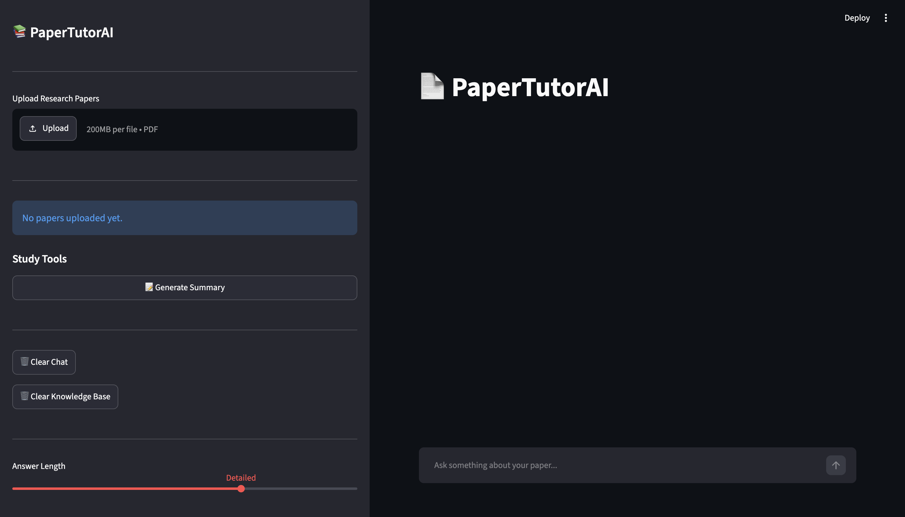
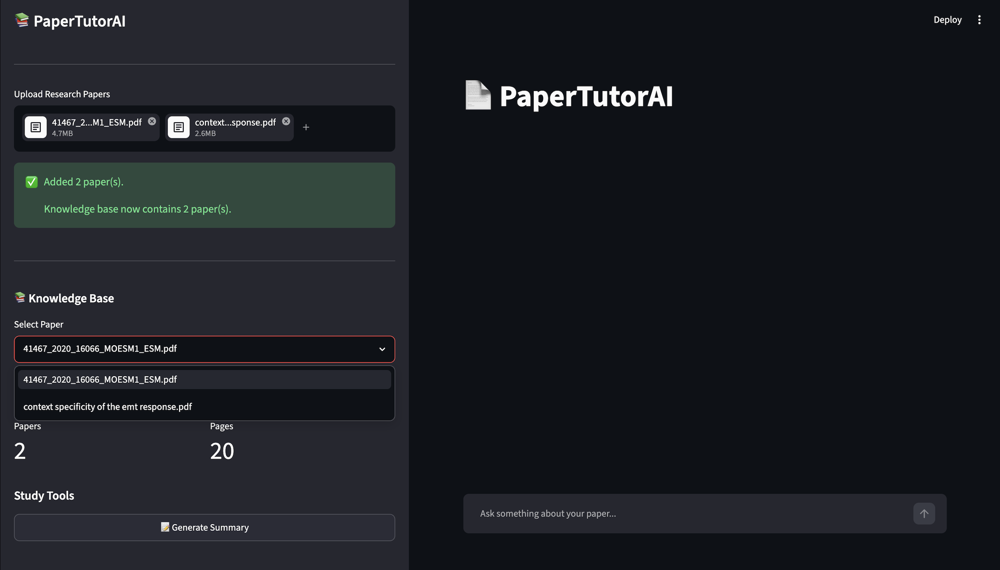
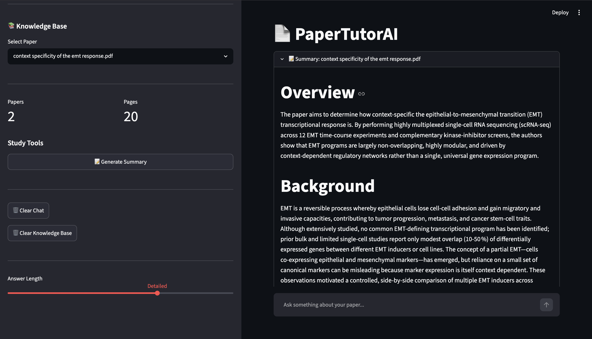
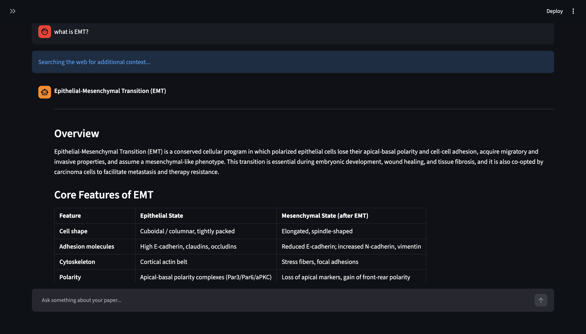
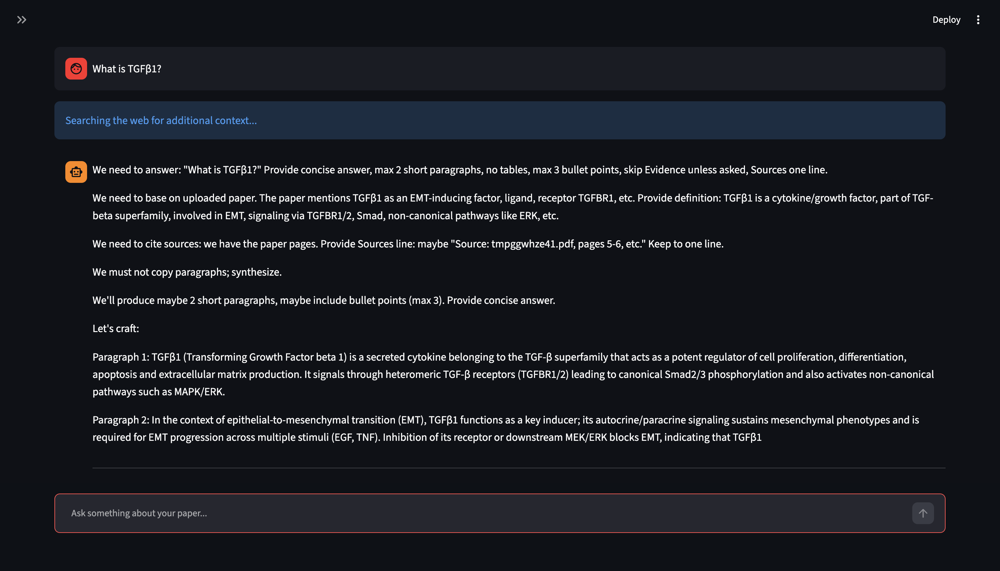

# 📚 PaperTutorAI

> An AI-powered research paper assistant that lets you upload scientific papers, generate comprehensive summaries, and chat with them using Retrieval-Augmented Generation (RAG).


---

## ✨ Features

- 📄 Upload one or multiple research papers
- 📚 Persistent multi-paper knowledge base
- 📝 Generate detailed AI summaries for any selected paper
- 💬 Chat with one or multiple papers simultaneously
- 🔍 Hybrid retrieval using FAISS + BM25
- 🌐 Automatic web search for background concepts
- 🎚 Adjustable answer length (Short → Very Detailed)
- 📖 Source attribution with page references
- 🧹 Clear chat while preserving the knowledge base
- ♻ Reset the entire knowledge base with one click

---

# 📸 Demo

## Home



---

## Multi-Paper Knowledge Base



---

## AI Paper Summary



---

## Detailed Research Assistant



---

## Short Answers



---

## Adjustable Response Length


---

## 🏗 Architecture

```text
                   PDF Upload
                        │
                        ▼
               PyMuPDF Text Extraction
                        │
                        ▼
                Semantic Chunking
                        │
                        ▼
         SentenceTransformer Embeddings
                        │
                        ▼
             FAISS Vector Database
                        │
        ┌───────────────┴───────────────┐
        ▼                               ▼
 Semantic Retrieval              BM25 Retrieval
        └───────────────┬───────────────┘
                        ▼
               Hybrid Rank Fusion
                        │
                        ▼
          Context Assembly + Web Search
                        │
                        ▼
                 OpenRouter LLM
                        │
        ┌───────────────┴───────────────┐
        ▼                               ▼
      Chat Answers                 Paper Summary
```

---

## 🖥 Interface

- Upload multiple PDFs
- Select a paper for summarization
- Ask questions across the entire knowledge base
- Adjustable answer verbosity
- Automatic citation of retrieved pages

---

## 📂 Project Structure

```text
PaperTutorAI/
│
├── app.py
├── rag/
│   ├── embeddings.py
│   ├── retriever.py
│   ├── chunker.py
│   ├── llm.py
│   └── context_checker.py
│
├── parsers/
├── services/
├── assets/
├── uploads/
├── exports/
├── requirements.txt
└── README.md
```

---

## ⚙ Installation

```bash
git clone https://github.com/oreomcflurryyy/PaperTutorAI.git

cd PaperTutorAI

python -m venv venv

source venv/bin/activate      # macOS/Linux

pip install -r requirements.txt
```

Create a `.env`

```env
OPENROUTER_API_KEY=your_api_key

OPENROUTER_MODEL=nvidia/nemotron-3-super-120b-a12b:free
```

Run

```bash
streamlit run app.py
```

---

## 🚀 Usage

1. Upload one or more research papers.
2. The application extracts text and builds a hybrid vector database.
3. Select a paper from the Knowledge Base.
4. Generate a detailed summary for the selected paper.
5. Ask questions across all uploaded papers.
6. Adjust answer length using the response slider.
7. Clear chat without deleting uploaded papers.
8. Reset the knowledge base when starting a new project.

---

## 🧠 Tech Stack

| Component | Technology |
|-----------|------------|
| Frontend | Streamlit |
| PDF Parsing | PyMuPDF |
| Embeddings | SentenceTransformers |
| Vector Search | FAISS |
| Keyword Search | BM25 |
| LLM | OpenRouter |
| Language | Python |

---

## 🔬 Pipeline

1. PDF parsing
2. Text preprocessing
3. Semantic chunking
4. Embedding generation
5. FAISS indexing
6. BM25 indexing
7. Hybrid retrieval
8. Context aggregation
9. Optional web search
10. LLM response generation
11. Source attribution

---

## 🔮 Future Improvements

- Cross-paper comparison mode
- Figure and table understanding
- PDF export of summaries
- Citation-aware responses
- Conversation memory
- OCR support for scanned PDFs
- ArXiv paper import
- DOI-based retrieval

---

## 📄 License

MIT License
